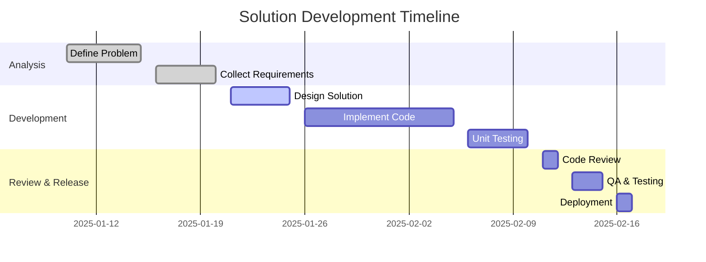
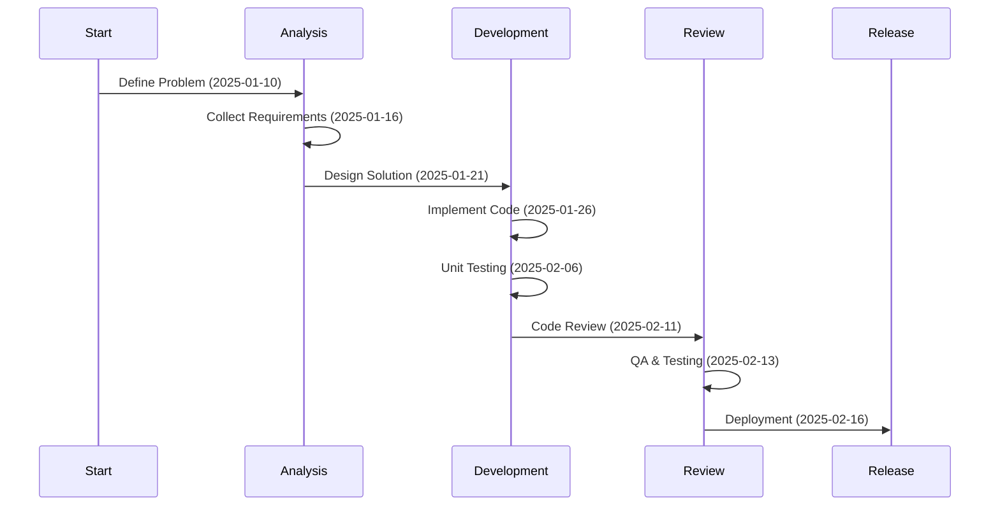
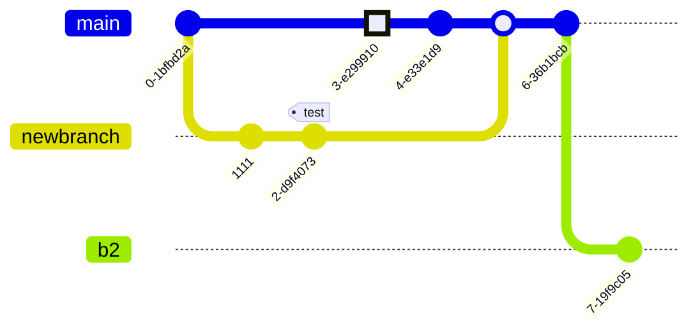
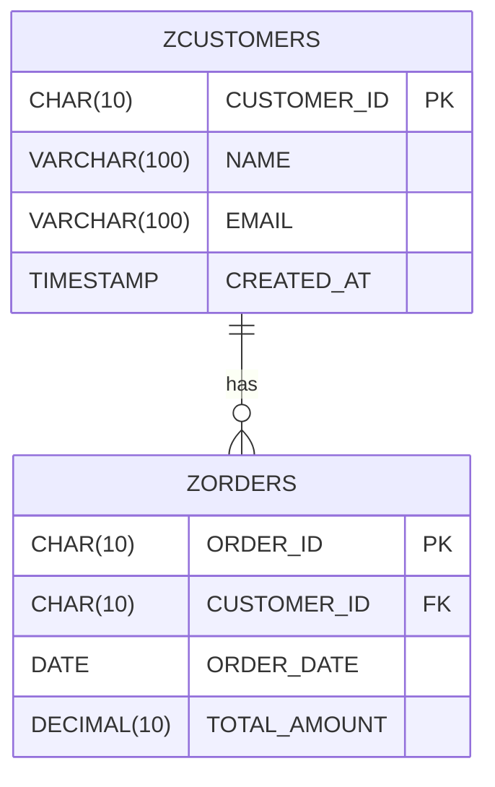

# service-priority
 Lista de manutenção de prioridades de atendimento

Para atender a necessidade, a tabela criada ficaria da seguinte forma.

## Tecnologias usadas
PAra atender a necessidade, o desenvolvimento será feito em SAP usando linguagem ABAP.

Dentro dos recursos que linguagem nos fornece, vamos usar o framework ALV com as possibilidades de "drag-Drop" para fazer a interação com usuário;

A regra de negocio é que, para um incidente, sempre que for feita uma alteração de valores, os campos de 'ultima atualização' vão ser atualizados e também o texto descritivo.
Ao recuperar a informação pro incidente, vamos ter todo o histórico mas exibir apenas o mais recente que é o dado vigente

## Cenários

Aqui a lista com detalhes de alguns cenarios a considerar durante testes.

| Field        | Type         | Key | Description           |
|-------------|-------------|-----|----------------------|
| 🔗 | CHAR(10)     | PK  | Unique Customer ID   |
| NAME        | VARCHAR(100) |     | Customer Name        |
| EMAIL       | VARCHAR(100) |     | Customer Email       |
| CREATED_AT  | TIMESTAMP    |     | Record Creation Date |

## Não selecionar ABAP no POP
Verificar erro

## Quantidade de itens atendidos
Mostrar na opção de titulo, a quantidade de itens que estão sendo geridos para prioridades

## Alteração de BC do incidente
No caso de um atendimento ter sido iniciado por uma pessoa e depois passar para outra

## Table: ZCUSTOMERS 📋

| Field        | Type         | Key | Description           |
|-------------|-------------|-----|----------------------|
| CUSTOMER_ID | CHAR(10)     | PK  | Unique Customer ID   |
| NAME        | VARCHAR(100) |     | Customer Name        |
| EMAIL       | VARCHAR(100) |     | Customer Email       |
| CREATED_AT  | TIMESTAMP    |     | Record Creation Date |
