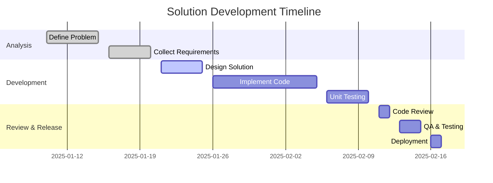
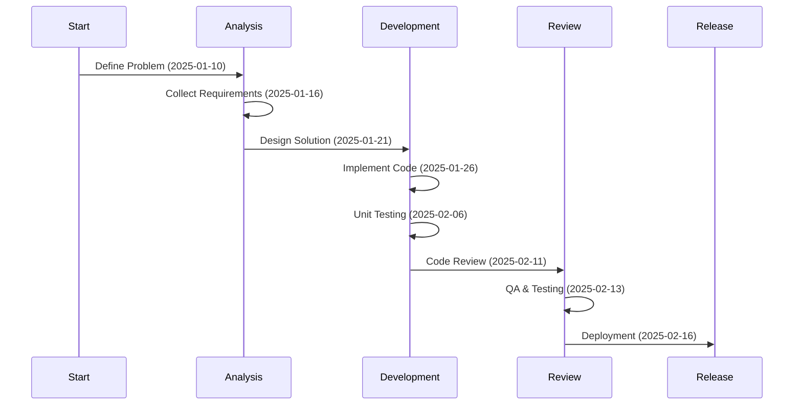

# service-priority
 Lista de manutenção de prioridades de atendimento

Para atender a necessidade, a tabela criada ficaria da seguinte forma.

## Tecnologias usadas
PAra atender a necessidade, o desenvolvimento será feito em SAP usando linguagem ABAP.

Dentro dos recursos que linguagem nos fornece, vamos usar o framework ALV com as possibilidades de "drag-Drop" para fazer a interação com usuário;

A regra de negocio é que, para um incidente, sempre que for feita uma alteração de valores, os campos de 'ultima atualização' vão ser atualizados e também o texto descritivo.
Ao recuperar a informação pro incidente, vamos ter todo o histórico mas exibir apenas o mais recente que é o dado vigente

